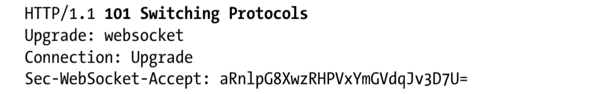
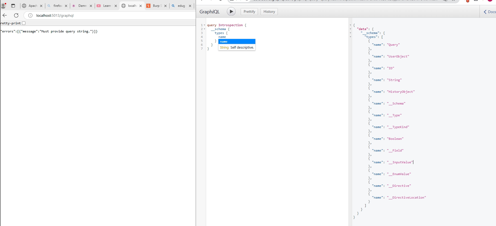

Absolutely! Here's a professional and well-structured `README.md` tailored for your GitHub repository that explains the GraphQL reconnaissance and attack surface presentation (including the use of WebSockets, Nmap, and discovery techniques):

---

```markdown
# 🛡️ GraphQL Reconnaissance & Attack Surface Mapping

This repository presents a detailed assessment of a GraphQL endpoint using both passive and active reconnaissance methods. It includes a structured **Gamma pitch deck**, **Nmap discovery techniques**, and **real-time WebSocket enumeration** to identify potential attack surfaces.

## 📑 Overview

- 🔍 Initial service discovery via **Nmap**
- 📂 Enumeration of GraphQL schema types
- 🌐 Identification of **GraphQL over WebSocket** for real-time subscription handling
- 📌 Payload samples for introspection and fuzzing
- 📊 Clean visual slides included for briefings and academic reporting

---

## 📸 Screenshots

| GraphQL Detection via Nmap | WebSocket Upgrade | Subscription Endpoint |
|----------------------------|-------------------|------------------------|
|  |  |  |

---

## 🧪 Tools Used

- **Nmap**  
  With `http-grep` and custom GraphQL patterns to fingerprint endpoints.

- **ffuf**  
  Fast directory/content fuzzing to enumerate GraphQL access points.

- **cURL & Burp Suite**  
  Manual probing of introspection and WebSocket headers.

---

## 🔧 Sample Queries

```bash
curl -X POST https://<target>/graphql \
-H "Content-Type: application/json" \
-d '{"query":"{__schema { types { name }}}"}'
```

### WebSocket Subscription (handshake)
```
GET /subscriptions HTTP/1.1
Host: <target>
Upgrade: websocket
Connection: Upgrade
Sec-WebSocket-Version: 13
Sec-WebSocket-Key: <key>
```

---

## ⚠️ Attack Surface Highlights

- **Open GraphQL introspection**
- **Accessible WebSocket upgrade over `/subscriptions`**
- **Unprotected query input allows for type & schema mapping**
- **Potential for unauthorized subscriptions**

---

## 📂 Contents

```
📁 /images                # Visual outputs for the presentation
📁 /slides                # Gamma pitch deck (PDF or HTML)
📄 README.md              # You're here!
```

---

## 📚 Related Concepts

- [GraphQL Introspection Attacks](https://blog.securityheaders.io/graphql-security-how-to-disable-introspection/)
- [WebSocket Hijacking](https://portswigger.net/web-security/websockets)
- [ffuf Usage Guide](https://github.com/ffuf/ffuf)

---

## 🧠 Authors & Credits

Part of the **KISEC Project 1** — GraphQL Threat Surface Discovery  
Maintained by: [`@aiegoo`](https://github.com/aiegoo)

---

## 📜 License

MIT License — Feel free to reuse and contribute.
```

---

Let me know if you'd like to generate this as a file (`README.md`) or tweak it for a specific project structure or tone (e.g. more academic, corporate, or hacker-style).